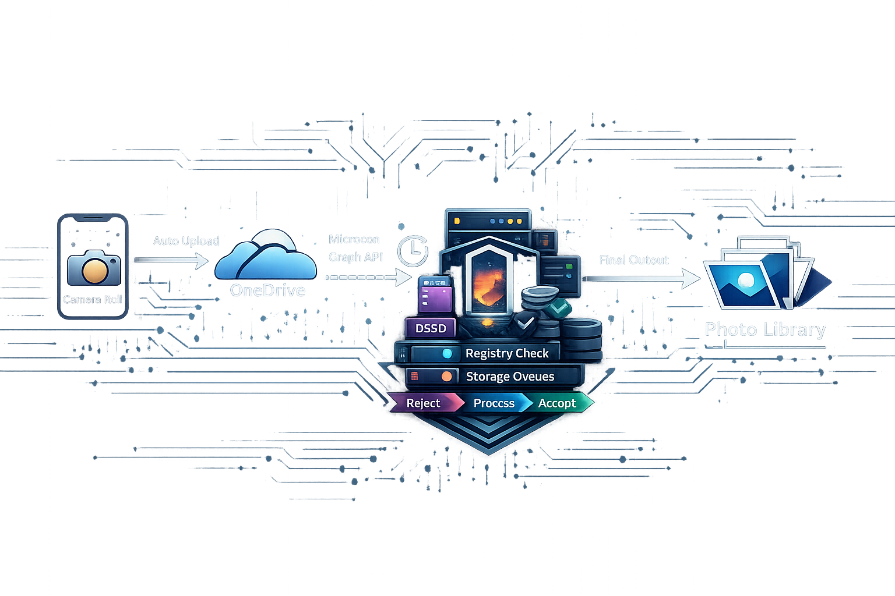

# nightfall-photo-ingress



An automated photo ingress pipeline for a self-hosted Linux media server. iOS devices
upload photos to OneDrive; this service polls OneDrive via the Microsoft Graph API,
downloads new files to a staging area, and queues them for explicit operator review
before they enter the permanent library.

All newly discovered files land in a **pending** state. Nothing reaches the accepted
queue without an explicit `accept` command. Rejected files are retained on disk until
explicitly purged.

---

## Use cases

- Automated ingestion from OneDrive Camera Roll into a ZFS-backed media server
- Operator-reviewed accept / reject workflow before files enter a local [Immich](https://immich.app/) installation.
- SHA-256 based deduplication across multiple OneDrive accounts
- Crash-safe, resumable Microsoft Graph API delta polling with structured observability

---

## CLI commands

```bash
# One-time: authenticate an OneDrive account (interactive device code flow)
nightfall-photo-ingress auth-setup --path /etc/nightfall/photo-ingress.conf

# Scheduled: poll OneDrive, download new files to pending/
nightfall-photo-ingress poll --path /etc/nightfall/photo-ingress.conf

# Review: accept or reject a file by SHA-256
nightfall-photo-ingress accept <sha256>
nightfall-photo-ingress reject <sha256>

# Maintenance: purge a rejected file from disk; reconcile trash/ directory
nightfall-photo-ingress purge <sha256>
nightfall-photo-ingress process-trash

# Import SHA-256 hashes from existing library (dedup on first poll)
nightfall-photo-ingress sync-import
```

Run any command with `--help` for full option descriptions.

---

## Current scope

**In scope:**
- OneDrive personal account polling via Microsoft Graph delta API
- Pending-first ingest lifecycle (pending → accepted / rejected → purged)
- Multi-account support (one `[account.*]` section per account)
- SHA-256-based deduplication and metadata pre-filter
- Live Photo pair detection and coordinated lifecycle handling
- Crash recovery via `IngestOperationJournal` (JSONL)
- Structured JSON logging and health status snapshot for nightfall monitoring
- Systemd one-shot timer deployment

**Out of scope (explicit):**
- Immich write path — Immich indexes the permanent library as a read-only external library only
- Automatic acceptance — every file requires an explicit operator decision
- Non-OneDrive sources — the adapter interface is defined, but only the OneDrive adapter exists today
- Media transcoding, thumbnail generation, or metadata editing

---

## Local development

```bash
python -m pip install -e ".[dev]"    # install in editable mode with dev extras
pytest                               # default isolated suite (unit + integration, including web API tests)
pytest tests/unit/                   # unit tests only (fast)
pytest tests/integration/            # integration tests
pytest tests/integration/api/        # isolated web control plane ASGI/API tests
pytest -m robustness                 # resilience regression suite only
```

### Development container workflow

An initial scaffold now exists for a dedicated development container named
`dev-photo-ingress`, separate from staging. See
`docs/deployment/dev-container-workflow.md` and
`design/architecture/environment-separation-and-container-lifecycle.md` for the
lifecycle and command surface.

### Test environment boundaries

- `tests/unit/` and `tests/integration/` are intended to run in a normal local development environment.
- `tests/integration/api/` contains isolated web control plane API contract tests using in-process ASGI transport; they do not require the staging environment.
- `tests/staging/` and `tests/staging-flow/` require the staging environment and may depend on runtime packages, container state, or other environment-specific prerequisites.

## Build and install

```bash
python -m build
python -m pip install dist/*.whl
```

---

## Repository layout

```text
nightfall-photo-ingress/
├── pyproject.toml
├── src/
│   └── nightfall_photo_ingress/
├── tests/
│   ├── unit/                   fast isolated tests
│   ├── integration/            isolated cross-module workflow tests
│   │   └── api/                isolated web control plane API contract tests
│   ├── staging/                staging-environment-only tests
│   └── staging-flow/           production-flow staging validation
├── conf/                       example configuration
├── docs/                       operator documentation and runbook
├── design/                     architecture and design documentation
├── planning/                   implementation plans (historical)
├── systemd/                    service and timer unit files
├── install/                    production install scripts
└── testspecs/                  test specification documents
```

---

## Further reading

| Document | Purpose |
|---|---|
| [ARCHITECTURE.md](ARCHITECTURE.md) | Module structure, key architectural properties, design doc index |
| [docs/operations-runbook.md](docs/operations-runbook.md) | Installation, configuration, day-to-day operator procedures |
| [staging/README.md](staging/README.md) | Staging container lifecycle and smoke contracts |
| [docs/deployment/dev-container-workflow.md](docs/deployment/dev-container-workflow.md) | Development container workflow and initial `devctl` scaffold (`dev-photo-ingress`) |
| [design/architecture/data-flow.md](design/architecture/data-flow.md) | End-to-end pipeline diagram and stage descriptions |
| [design/domain/domain-model.md](design/domain/domain-model.md) | Domain entities, bounded context, module responsibilities |
| [design/README.md](design/README.md) | Full design documentation index |

