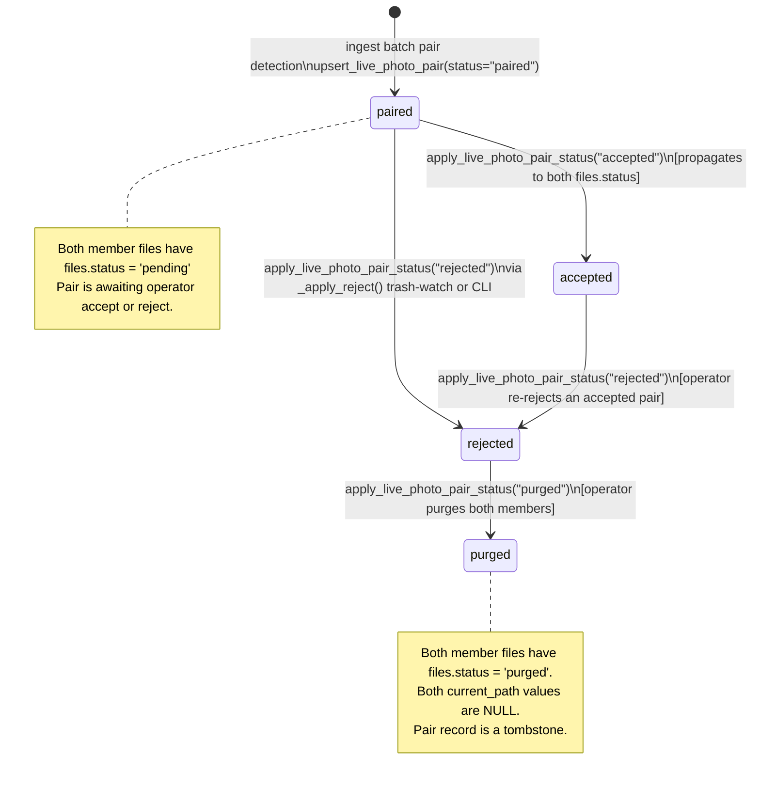

# Live Photo Pair Lifecycle

**Scope:** `live_photo_pairs` table and its `status` field  
**Source authority:** `src/nightfall_photo_ingress/live_photo.py`, `src/nightfall_photo_ingress/domain/registry.py`, `src/nightfall_photo_ingress/domain/ingest.py`, `src/nightfall_photo_ingress/reject.py`  
**Prerequisite:** [`design/architecture/state-machine.md`](state-machine.md) — `files.status` state machine  
**Status:** Authoritative  
**Created:** 2026-04-03  

---

## 1. Overview

A Live Photo is an Apple media format consisting of two files with the same stem but
different extensions: a still image (`.heic`, `.jpg`, `.jpeg`, or `.png`) and a short
video clip (`.mov`, `.mp4`, or `.m4v`). Both files must be treated as a unit during
operator review — accepting or rejecting one without the other produces an incomplete
result.

photo-ingress models this unit as a `live_photo_pairs` record that links two `files`
records. The pair has its own `status` field that is kept synchronised with the `files.status`
of both members.

This document defines:
- How pairs are detected during ingest.
- The relationship between the pair `status` and each member's `files.status`.
- All valid pair status values and transitions.
- The atomicity contract for status propagation.
- The behaviour when a pair cannot be assembled (one component missing from the batch).
- The operator rejection workflow for pairs.

---

## 2. Relationship Between `live_photo_pairs.status` and `files.status`

### 2.1 Why Two Status Fields?

Each member file has its own `files.status` record (4 values: `pending`, `accepted`,
`rejected`, `purged`). The `live_photo_pairs` table adds a composite `status` for the
pair as a whole (5 values: `paired`, `pending`, `accepted`, `rejected`, `purged`).

The pair status exists to allow logic that acts on the pair as a unit to read and update
a single authoritative record rather than querying both member records and reconciling
them. It also enables the reject path to detect pair membership before deciding whether to
reject a file individually or propagate the rejection to both members.

The pair status does NOT replace the member `files.status` values. Both are live, and after
any `apply_live_photo_pair_status()` call, both member `files.status` values and the pair
`status` should be equal. A discrepancy indicates a partial failure (see §6).

### 2.2 The Extra `paired` Value

The pair status has one value that `files.status` does not: `paired`. This is the initial
status assigned when a pair is first assembled during an ingest batch:

```
live_photo_pairs.status = 'paired'
files.status (photo member)  = 'pending'
files.status (video member)  = 'pending'
```

`paired` means: *both components are registered and linked; the pair is awaiting operator
review.* The operator will accept or reject the pair, which propagates `accepted` or
`rejected` to both member files and to the pair record simultaneously.

`paired` does not appear in `ALLOWED_FILE_STATUSES` and is never set on a `files` record.
It is exclusively a pair-level assembly marker.

---

## 3. Pair Detection During Ingest

### 3.1 Data Flow

Pair detection runs inside `IngestDecisionEngine.process_batch()`, interleaved with
individual file processing. A `DeferredPairQueue` is created at the start of each batch
and discarded at the end:

```python
pair_queue = DeferredPairQueue(live_photo_heuristics)   # created per batch
```

For each candidate outcome (in the order they complete, sorted by index after parallel
execution):

1. If the candidate produced a SHA-256 result, the mapping
   `sha_by_onedrive_id[onedrive_id] = sha256` is recorded.
2. `pair_queue.ingest(LivePhotoCandidate(...))` is called with the candidate's metadata.
3. If `ingest()` returns a `LivePhotoPair`, and both member SHA-256s are in
   `sha_by_onedrive_id`, `registry.upsert_live_photo_pair()` is called with
   `status="paired"`.

### 3.2 Pairing Heuristics (V1)

The V1 heuristic set is enforced at runtime — all four parameters must be their defaults
or `LivePhotoError` is raised immediately at `DeferredPairQueue.__init__()`:

| Parameter | V1 default | Meaning |
|-----------|-----------|---------|
| `capture_tolerance_seconds` | `3` | Maximum absolute difference in `captured_at` timestamps for two files to be considered a pair |
| `stem_mode` | `exact_stem` | Two files are pair candidates if `Path(filename).stem` is identical (stem = filename without extension) |
| `component_order` | `photo_first` | No runtime effect in V1; reserved for future ordering guarantees |
| `conflict_policy` | `nearest_capture_time` | When multiple counterparts exist, pick the one with the smallest `abs(captured_at - candidate_captured_at)` time difference |

### 3.3 Component Classification

A file's role (photo or video) is determined from its extension:

| Extensions | Component role |
|-----------|---------------|
| `.heic`, `.jpg`, `.jpeg`, `.png` | `photo` |
| `.mov`, `.mp4`, `.m4v` | `video` |
| any other | not a Live Photo component — skipped by `_classify_component()` |

Files with unrecognised extensions are not added to the `DeferredPairQueue` and cannot
form pairs. They pass through the standard `files.status` state machine as ordinary files.

### 3.4 Within-Batch Matching Algorithm

For each candidate `C` entering `DeferredPairQueue.ingest()`:

1. Classify `C`'s component (photo or video). If unclassifiable, return `None` immediately.
2. Compute `stem = Path(C.filename).stem`.
3. Compute `captured_at` as a UTC-normalised `datetime`.
4. Search the queue for an eligible counterpart: same `account`, same `stem`, opposite
   component type, `|captured_at_queued - captured_at_C| ≤ 3 seconds`.
5. **No counterpart found:** Add `C` to the queue. Return `None`. C's files record already
   has `status='pending'` from `_process_one()`; no pair record is created.
6. **One or more counterparts found:** Select the one with the smallest capture time
   difference. Remove it from the queue. Construct and return a `LivePhotoPair`.
7. The caller then checks that both SHA-256s are in `sha_by_onedrive_id` and, if so,
   calls `upsert_live_photo_pair(status="paired")`.

### 3.5 Pair ID Generation

The `pair_id` is a 32-character hex value derived by SHA-256 hashing the concatenation
`{account}|{stem}|{photo_sha256}|{video_sha256}`:

```python
raw = f"{account}|{stem}|{photo_sha256}|{video_sha256}"
pair_id = hashlib.sha256(raw.encode("utf-8")).hexdigest()[:32]
```

This makes the `pair_id` **deterministic and content-addressed**. If the same pair is
ingested again (both files reappear in a later batch with the same content), the
`upsert_live_photo_pair()` call resolves to an `ON CONFLICT DO UPDATE` that leaves the
pair record unchanged.

### 3.6 Upsert Semantics

`upsert_live_photo_pair()` uses:
```sql
ON CONFLICT(pair_id) DO UPDATE SET
    account = excluded.account, stem = excluded.stem,
    photo_sha256 = excluded.photo_sha256, video_sha256 = excluded.video_sha256,
    status = excluded.status, updated_at = excluded.updated_at
```

**The upsert always overwrites `status`.** If a pair was previously `rejected` and the
same content is re-ingested in a new batch, `upsert_live_photo_pair(status="paired")` will
reset the pair record to `paired`. However, the member `files` records still have
`status='rejected'` (not touched by this upsert), creating an inconsistency. This scenario
should not occur in normal operation because re-ingested known files are discarded by
`finalize_known_ingest()` before reaching the pair queue; the pair upsert path is only
reached when both files yield SHA-256s in the current batch (i.e. both are unknown hashes).

---

## 4. Pair Status State Machine

### 4.1 Valid Pair Status Values

| Value | Meaning |
|-------|---------|
| `paired` | Initial state: both components are registered in `files` as `pending`; pair assembled, awaiting operator review |
| `pending` | Defined in schema, accepted by `upsert_live_photo_pair()`, but no current code path sets it (reserved for future use) |
| `accepted` | Operator has accepted the pair; both member files are `accepted` |
| `rejected` | Operator has rejected the pair; both member files are `rejected` |
| `purged` | Both member files have been purged; pair record is a tombstone |

### 4.2 State Diagram



### 4.3 Pair Transition Table

| # | From | To | Trigger | Registry method | Guard | Side effects | Error if guard fails |
|---|------|----|---------|-----------------|-------|-------------|----------------------|
| PT-1 | *(new)* | `paired` | Ingest batch: both components in same batch | `upsert_live_photo_pair(status="paired")` | Both SHA-256s in `sha_by_onedrive_id` | Pair row created; member `files.status` already `pending` from T-1 (no change to files) | Guard is a code-path condition — if either SHA-256 is missing, the upsert is simply not called |
| PT-2 | `paired` | `accepted` | Operator accepts the pair (via accept flow applied to both members) | `apply_live_photo_pair_status(new_status="accepted")` | Pair must exist (`get_live_photo_pair()` returns non-None). Member `files` must exist in registry. | Both member `files.status` → `accepted`; pair `status` → `accepted`; `audit_log` rows per member | `RegistryError("Missing live photo pair: <pair_id>")` |
| PT-3 | `paired` | `rejected` | Operator moves either member to trash; or CLI `reject` on either member | `apply_live_photo_pair_status(new_status="rejected")` via `_apply_reject()` | Pair exists; `pair.status != "rejected"` (checked in `_apply_reject()`) | Both members physically moved to `rejected_path`; both `files.status` → `rejected`; pair `status` → `rejected`; `audit_log` per member | `RegistryError` on pair lookup failure |
| PT-4 | `accepted` | `rejected` | Operator moves either accepted member to trash | `apply_live_photo_pair_status(new_status="rejected")` via `_apply_reject()` | Same as PT-3 | Same as PT-3; file move is from `accepted_path` to `rejected_path` | Same as PT-3 |
| PT-5 | `rejected` | `purged` | Operator purges both members (individual `purge_sha256()` calls) | `finalize_purge_from_rejected()` per member; no single pair-level purge operation | Each member: `files.status == 'rejected'` | Each member independently purged via T-6 (`files.status` → `purged`, `current_path` → NULL). Pair `status` is **not** automatically updated to `purged` by `finalize_purge_from_rejected()`. | `RejectFlowError` per member if not in `rejected` state |

**Important note on PT-5:** There is no `apply_live_photo_pair_status("purged")` code path
in the current implementation. Purge is always performed via individual `purge_sha256()`
calls on each member. After both members are purged, the pair record retains its last
`status` value (typically `rejected`) until the next action. The pair record is never
automatically set to `purged`. This is a known asymmetry: the pair `status` field accepts
`purged` in the schema and in `upsert_live_photo_pair()`, but no standard code path drives
the pair record to `purged`.

---

## 5. Pair Rejection: Both-or-Nothing Semantics

When the operator moves either member of a pair to trash (or invokes `reject` on either
member's SHA-256), `_apply_reject()` in `reject.py` detects the pair membership:

```python
pair = registry.get_live_photo_pair_for_member(sha256=sha256)
if pair is not None and pair.status != "rejected":
    # --- reject BOTH members ---
    _move_to_rejected_folder(registry, pair.photo_sha256, ...)
    _move_to_rejected_folder(registry, pair.video_sha256, ...)
    registry.apply_live_photo_pair_status(pair_id=pair.pair_id, new_status="rejected", ...)
    return RejectResult(action="rejected_pair", ...)
```

**Consequence:** Rejecting one member of a Live Photo pair always rejects the other member
too. The outcome action string for this path is `rejected_pair`. The file that was not
passed to `reject_sha256()` directly is still moved to the rejected folder and marked
`rejected`.

**If the pair is already `rejected`:** The pair check is bypassed (`pair.status == "rejected"`
is true) and the single-file path runs instead, producing a `reject_noop_already_rejected`
result for the already-rejected file.

**Partial pair state as input:** The both-or-nothing logic applies at the point when the
reject action is taken. If somehow one member was accepted and the other is still pending,
rejecting either one causes `_move_to_rejected_folder()` to run for both — moving the
accepted file from `accepted_path` and the pending file from `pending_path`.

---

## 6. Atomicity Contract

`apply_live_photo_pair_status()` is **not atomic across all three records** (photo member,
video member, pair record). It executes three independent database connections:

```
Connection 1: transition_status(photo_sha256, new_status)   → own BEGIN IMMEDIATE tx
Connection 2: transition_status(video_sha256, new_status)   → own BEGIN IMMEDIATE tx
Connection 3: UPDATE live_photo_pairs SET status = ...      → own BEGIN IMMEDIATE tx
```

**Failure modes:**

| Failure point | Observable state | Recovery |
|--------------|-----------------|---------|
| After Connection 1 (photo updated), before Connection 2 | `files.status` for photo = `new_status`; `files.status` for video = original; pair `status` = original | Photo and pair are inconsistent. No automatic recovery. Operator must manually inspect. |
| After Connection 2 (both files updated), before Connection 3 | Both `files.status` = `new_status`; pair `status` = original | Pair record lags. A re-run of `apply_live_photo_pair_status()` with the same `new_status` will re-apply (idempotent for member transitions since `transition_status()` does not guard source status) and update the pair record. |
| Error inside Connection 1 | No change | Safe: all three records remain at original status. |

**Practical risk:** This failure mode requires a crash or exception between SQLite commits —
unlikely in normal operation but not impossible. Monitoring tools that read both
`files.status` for both members and `live_photo_pairs.status` can detect the discrepancy
by checking that all three values are equal for any pair record.

---

## 7. Unresolved Candidates (One Component Missing from Batch)

When a Live Photo's two components arrive in different batches, or when one component
cannot be classified:

- Each component is ingested individually via `_process_one()` → `finalize_unknown_ingest()`
  → `files.status = 'pending'`.
- No `live_photo_pairs` record is created.
- The `DeferredPairQueue` is batch-scoped and discarded after each batch completes.
- Unresolved candidates in the queue at batch end are simply abandoned — they remain as
  ordinary `pending` files with no pair linkage.

**Operator implications:** If only the photo component arrives in batch 1 and the video
arrives in batch 2:
- After batch 1: photo file is `pending`, no pair record.
- After batch 2: video file is `pending`, no pair record.
- The operator sees two independent `pending` files and must handle them separately.
- Rejecting the photo via trash does NOT trigger pair protection (no pair record exists).

There is no cross-batch pair assembly mechanism in V1.

---

## 8. `live_photo_pairs` Table Schema

```sql
CREATE TABLE IF NOT EXISTS live_photo_pairs (
    pair_id     TEXT PRIMARY KEY,
    account     TEXT NOT NULL,
    stem        TEXT NOT NULL,
    photo_sha256 TEXT NOT NULL,
    video_sha256 TEXT NOT NULL,
    status      TEXT NOT NULL CHECK (status IN ('paired', 'pending', 'accepted', 'rejected', 'purged')),
    created_at  TEXT NOT NULL,
    updated_at  TEXT NOT NULL,
    FOREIGN KEY (photo_sha256) REFERENCES files(sha256),
    FOREIGN KEY (video_sha256) REFERENCES files(sha256)
);
```

**Foreign key enforcement:**  Both `photo_sha256` and `video_sha256` are foreign keys to
`files(sha256)`. With `PRAGMA foreign_keys = ON` (set at every connection open), inserting
a pair whose members are not yet in `files` will raise a constraint error. In the ingest
batch path, `finalize_unknown_ingest()` is always called before `upsert_live_photo_pair()`,
so both member `files` rows exist before the pair row is inserted.

**`pair_id` key stability:** Because `pair_id` is derived from content
(`account|stem|photo_sha256|video_sha256`), it is stable across ingest replays of
identical content.

---

## 9. Relationship to `files.status` State Machine

The following diagram shows how pair-level transitions (§4) map to member `files.status`
transitions (documented in [`design/architecture/state-machine.md`](state-machine.md)):

| Pair transition | Photo `files.status` transition | Video `files.status` transition | Mechanism |
|----------------|--------------------------------|--------------------------------|-----------|
| PT-1: `(new) → paired` | `(new) → pending` (T-1, before pair detection) | `(new) → pending` (T-1, before pair detection) | `finalize_unknown_ingest()` per member; `upsert_live_photo_pair()` is non-destructive to member statuses |
| PT-2: `paired → accepted` | `pending → accepted` (via `transition_status()`) | `pending → accepted` (via `transition_status()`) | `apply_live_photo_pair_status()` calls `transition_status()` per member |
| PT-3: `paired → rejected` | `pending → rejected` (T-3 via `transition_status()`) | `pending → rejected` (T-3 via `transition_status()`) | `_apply_reject()` calls `apply_live_photo_pair_status()` |
| PT-4: `accepted → rejected` | `accepted → rejected` (T-4 via `transition_status()`) | `accepted → rejected` (T-4 via `transition_status()`) | Same as PT-3 |
| PT-5: individual purges | `rejected → purged` (T-6 per member) | `rejected → purged` (T-6 per member) | `finalize_purge_from_rejected()` per member; pair record NOT updated |

---

## 10. Cross-References

- **`files.status` state machine:** [`design/architecture/state-machine.md`](state-machine.md) — all transitions that `apply_live_photo_pair_status()` drives on member files are defined there as T-3/T-4 via `transition_status()`.
- **Schema definition:** [`design/architecture/schema-and-migrations.md`](schema-and-migrations.md) — full DDL for `live_photo_pairs` including CHECK constraint and foreign keys.
- **Domain overview:** [`design/domain-architecture-overview.md`](../domain-architecture-overview.md) — §6 Pipeline Behaviour describes the accept/reject flow in narrative form.
- **Operator reject workflow:** [`docs/operations-runbook.md`](../../docs/operations-runbook.md) — CLI usage for `reject`, `accept`, `purge`, and trash-watch setup.
