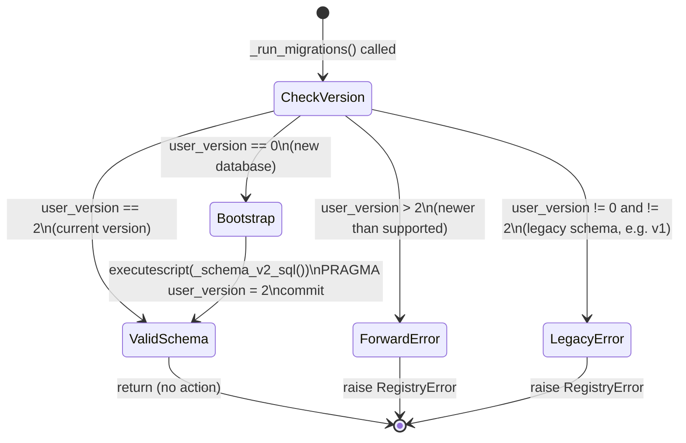

# Schema and Migrations

**Scope:** SQLite schema versioning, bootstrap path, additive extension mechanism, and web control plane schema additions  
**Source authority:** `src/nightfall_photo_ingress/domain/registry.py` (functions: `_run_migrations`, `_schema_v2_sql`, `_ensure_optional_tables`, `_set_pragmas`, `Registry.initialize`)  
**Prerequisite:** [`design/architecture/state-machine.md`](state-machine.md) — `files.status` state machine  
**Status:** Authoritative  
**Created:** 2026-04-03  

---

## 1. Overview

`photo-ingress` stores all ingest state, acceptance history, and audit records in a single
SQLite database file. The schema version is tracked directly in the SQLite file using the
built-in `PRAGMA user_version` mechanism. There is no third-party migration library; all
migration and bootstrap logic resides in `src/nightfall_photo_ingress/domain/registry.py`.

The current supported schema version is **2** (`LATEST_SCHEMA_VERSION = 2`). Chunk 1
does not increment `PRAGMA user_version`; it adds optional tables idempotently after
baseline schema validation.

---

## 2. `PRAGMA user_version` as the Schema Version Carrier

SQLite's `PRAGMA user_version` is a 32-bit integer stored in the database file header
(bytes 60–63). It is application-managed — SQLite itself never modifies it. photo-ingress
reads it on every `Registry.initialize()` call and writes it exactly once during the v2
bootstrap to record that the schema has been established.

```sql
-- Read the current version
PRAGMA user_version;

-- Write a new version (done programmatically in bootstrap)
PRAGMA user_version = 2;
```

Because `user_version` is stored in the file header, it is available even before any
application tables exist. A value of `0` means either a brand-new empty file or a file
that has never been bootstrapped by photo-ingress.

---

## 3. `Registry.initialize()`

`initialize()` is the single entry point for all schema management. It must be called once
before using a registry instance. All other `Registry` methods assume the schema is
already valid; they do not call `_run_migrations()` themselves.

```python
def initialize(self) -> None:
    self._db_path.parent.mkdir(parents=True, exist_ok=True)
    with self._connect() as conn:
        _set_pragmas(conn)
        _run_migrations(conn)
        _ensure_optional_tables(conn)
```

**Execution order within `initialize()`:**

| Step | Function | Purpose |
|------|----------|---------|
| 1 | `_set_pragmas(conn)` | Enable WAL mode and foreign key enforcement |
| 2 | `_run_migrations(conn)` | Bootstrap or validate schema version |
| 3 | `_ensure_optional_tables(conn)` | Idempotently create additive tables, including web control plane support tables |

---

## 4. Per-Connection Pragmas (`_set_pragmas`)

Two pragmas are applied to **every** database connection opened by the registry, not only
during `initialize()`:

```python
def _set_pragmas(conn: sqlite3.Connection) -> None:
    conn.execute("PRAGMA journal_mode = WAL")
    conn.execute("PRAGMA foreign_keys = ON")
```

| Pragma | Value | Effect |
|--------|-------|--------|
| `journal_mode` | `WAL` | Write-ahead logging: readers do not block writers; a crash leaves a recoverable WAL file rather than a corrupt database |
| `foreign_keys` | `ON` | Enforces all `FOREIGN KEY` constraints at run time; SQLite disables FK enforcement by default |

**Why per-connection?** SQLite pragma settings are connection-scoped, not stored in the
database file. Any connection that opens the database without executing these pragmas
operates without WAL mode and without FK enforcement. `_set_pragmas()` is therefore called
at the top of every private `_connect()` block throughout `registry.py`.

---

## 5. Migration State Machine (`_run_migrations`)

`_run_migrations()` reads `PRAGMA user_version` and branches into one of three paths:

```
user_version == 0     → Bootstrap path: run full v2 DDL, set user_version = 2
user_version > 2      → Hard error: "newer than supported"
user_version != 2     → Hard error: "Legacy registry schema detected"
(user_version == 2)   → Pass-through: valid schema, no action
```

### 5.1 Branch Details

**Branch A — Bootstrap (user_version = 0)**

Executes `_schema_v2_sql()` as an `executescript()` call, then:
```sql
PRAGMA user_version = 2;
```
After this, the database contains all baseline v2 tables, triggers, and `user_version = 2`.
This is the normal path for a first-time deployment.

**Branch B — Forward incompatibility guard (user_version > 2)**

Raises immediately:
```
RegistryError: "Database schema version {current} is newer than supported {LATEST_SCHEMA_VERSION}"
```
This prevents an older runtime binary from operating against a database that was created by
a newer binary. The operator must upgrade the binary before accessing the database.

**Branch C — Legacy version guard (user_version != 0 and != 2, which in practice means = 1)**

Raises immediately:
```
RegistryError: "Legacy registry schema detected. v2.0 requires a freshly bootstrapped
registry.db at schema {LATEST_SCHEMA_VERSION}; found schema {current}."
```
There is no automatic migration from v1 to v2. A v1 database must be abandoned and a fresh
v2 database bootstrapped. Any data in the v1 database must be re-ingested.

**Branch D — Valid schema (user_version = 2)**

`_run_migrations()` returns without taking any action. The schema is already at the correct
version; `_ensure_optional_tables()` runs next.

### 5.2 State Diagram



---

## 6. Base v2 Schema (`_schema_v2_sql`)

The following tables and triggers are created during bootstrap. All statements use
`CREATE TABLE IF NOT EXISTS` / `CREATE TRIGGER IF NOT EXISTS` to make the script safe to
re-execute, although in practice bootstrap only runs once (on a version-0 database).

### 6.1 Table Inventory

| Table | Primary Key | Purpose |
|-------|------------|---------|
| `files` | `sha256` | System of record for every unique file seen; holds `status` field for the 4-value state machine |
| `metadata_index` | `(account_name, onedrive_id)` | Pre-filter cache of OneDrive item metadata; used to skip unchanged remote files without re-downloading |
| `accepted_records` | `id` (AUTOINCREMENT) | Immutable log of each per-file acceptance event; stores authoritative `account`, `source_path`, and `accepted_at` |
| `file_origins` | `(account, onedrive_id)` | Maps OneDrive identifiers to `sha256`; supports path-hint tracking across renames |
| `audit_log` | `id` (AUTOINCREMENT) | Append-only event log for all state transitions and pipeline decisions; protected by immutability triggers |
| `live_photo_pairs` | `pair_id` | Links two `files` rows (photo + video) as a Live Photo pair; holds `status` for pair lifecycle (see [`design/architecture/live-photo-pair-lifecycle.md`](live-photo-pair-lifecycle.md)) |
| `external_hash_cache` | `(account_name, source_relpath, hash_algo, hash_value)` | Caches externally-provided hash values (e.g., from sidecar files or provider APIs) alongside their verified `sha256` |

### 6.2 Table Definitions

```sql
CREATE TABLE IF NOT EXISTS files (
    sha256          TEXT PRIMARY KEY,
    size_bytes      INTEGER NOT NULL,
    status          TEXT NOT NULL CHECK (status IN ('pending', 'accepted', 'rejected', 'purged')),
    original_filename TEXT,
    current_path    TEXT,
    first_seen_at   TEXT NOT NULL,
    updated_at      TEXT NOT NULL
);

CREATE TABLE IF NOT EXISTS metadata_index (
    account_name    TEXT NOT NULL,
    onedrive_id     TEXT NOT NULL,
    size_bytes      INTEGER NOT NULL,
    modified_time   TEXT NOT NULL,
    sha256          TEXT NOT NULL,
    created_at      TEXT NOT NULL,
    updated_at      TEXT NOT NULL,
    PRIMARY KEY (account_name, onedrive_id)
);

CREATE TABLE IF NOT EXISTS accepted_records (
    id              INTEGER PRIMARY KEY AUTOINCREMENT,
    sha256          TEXT NOT NULL,
    account         TEXT NOT NULL,
    source_path     TEXT NOT NULL,
    accepted_at     TEXT NOT NULL,
    FOREIGN KEY (sha256) REFERENCES files(sha256)
);

CREATE TABLE IF NOT EXISTS file_origins (
    account         TEXT NOT NULL,
    onedrive_id     TEXT NOT NULL,
    sha256          TEXT NOT NULL,
    path_hint       TEXT,
    first_seen_at   TEXT NOT NULL,
    last_seen_at    TEXT NOT NULL,
    PRIMARY KEY (account, onedrive_id),
    FOREIGN KEY (sha256) REFERENCES files(sha256)
);

CREATE TABLE IF NOT EXISTS audit_log (
    id              INTEGER PRIMARY KEY AUTOINCREMENT,
    sha256          TEXT,
    account_name    TEXT,
    action          TEXT NOT NULL,
    reason          TEXT,
    details_json    TEXT,
    actor           TEXT NOT NULL,
    ts              TEXT NOT NULL
);

CREATE TABLE IF NOT EXISTS live_photo_pairs (
    pair_id         TEXT PRIMARY KEY,
    account         TEXT NOT NULL,
    stem            TEXT NOT NULL,
    photo_sha256    TEXT NOT NULL,
    video_sha256    TEXT NOT NULL,
    status          TEXT NOT NULL CHECK (status IN ('paired', 'pending', 'accepted', 'rejected', 'purged')),
    created_at      TEXT NOT NULL,
    updated_at      TEXT NOT NULL,
    FOREIGN KEY (photo_sha256) REFERENCES files(sha256),
    FOREIGN KEY (video_sha256) REFERENCES files(sha256)
);

CREATE TABLE IF NOT EXISTS external_hash_cache (
    account_name    TEXT NOT NULL,
    source_relpath  TEXT NOT NULL,
    hash_algo       TEXT NOT NULL,
    hash_value      TEXT NOT NULL,
    verified_sha256 TEXT,
    first_seen_at   TEXT NOT NULL,
    updated_at      TEXT NOT NULL,
    PRIMARY KEY (account_name, source_relpath, hash_algo, hash_value)
);
```

### 6.3 Immutability Triggers on `audit_log`

Two triggers enforce that `audit_log` is strictly append-only. Any `UPDATE` or `DELETE`
against any `audit_log` row raises a `FAIL`-level error immediately, aborting the
statement:

```sql
CREATE TRIGGER IF NOT EXISTS trg_audit_log_no_update
BEFORE UPDATE ON audit_log
BEGIN
    SELECT RAISE(FAIL, 'audit_log is append-only');
END;

CREATE TRIGGER IF NOT EXISTS trg_audit_log_no_delete
BEFORE DELETE ON audit_log
BEGIN
    SELECT RAISE(FAIL, 'audit_log is append-only');
END;
```

These triggers fire at the SQLite engine level, bypassing application code entirely. They
protect the audit trail even if a bug in `registry.py` attempts a destructive audit
operation.

---

## 7. Additive Extension Pattern (`_ensure_optional_tables`)

`_ensure_optional_tables()` provides a lightweight mechanism for adding new tables within
the v2 runtime lifetime **without incrementing `user_version`**.

```python
def _ensure_optional_tables(conn: sqlite3.Connection) -> None:
    conn.executescript("""
CREATE TABLE IF NOT EXISTS ingest_terminal_audit ( ... );
    """)
    conn.commit()
```

**Design contract:**
- Each table in `_ensure_optional_tables()` must use `CREATE TABLE IF NOT EXISTS` so that
  the function is fully idempotent — safe to run on every `initialize()` call whether the
  table already exists or not.
- Adding a table here does NOT change `user_version`. The table will be silently created
  on first use after any `initialize()` call, regardless of when the database was first
  bootstrapped.
- This pattern is suitable ONLY for **additive, standalone tables** (new columns in
  existing tables require a `user_version` increment and a migration step).
- Removing a table from `_ensure_optional_tables()` does not drop the table from existing
  databases; old tables persist until explicitly dropped.

### 7.1 Currently Registered Optional Tables

The current runtime registers three optional tables:

| Table | Purpose |
|-------|---------|
| `ingest_terminal_audit` | Additive ingest diagnostics for later runtime analysis |
| `blocked_rules` | Web control plane blocklist storage used by Chunk 1 read APIs |
| `ui_action_idempotency` | Future write-path idempotency replay storage |

These tables are additive extensions to schema version 2. They are not modeled as a
schema version 3 and they are not currently driven by a numbered migration runner.

### 7.2 `ingest_terminal_audit`

```sql
CREATE TABLE IF NOT EXISTS ingest_terminal_audit (
    id              INTEGER PRIMARY KEY AUTOINCREMENT,
    batch_run_id    TEXT NOT NULL,
    sequence_no     INTEGER NOT NULL,
    account         TEXT NOT NULL,
    onedrive_id     TEXT NOT NULL,
    sha256          TEXT,
    action          TEXT NOT NULL,
    reason          TEXT,
    actor           TEXT NOT NULL,
    ts              TEXT NOT NULL
);
```

| Column | Type | Purpose |
|--------|------|---------|
| `id` | INTEGER | Surrogate row key |
| `batch_run_id` | TEXT | UUID or identifier for the batch invocation that produced this record |
| `sequence_no` | INTEGER | Position of this item within the batch, for ordered replay |
| `account` | TEXT | Account name for the ingested file |
| `onedrive_id` | TEXT | OneDrive item identifier |
| `sha256` | TEXT | Content hash (NULL if hashing failed or file was skipped before hashing) |
| `action` | TEXT | Terminal disposition of this item in the batch (e.g. `new_unknown`, `discard_known`, `discard_purged`) |
| `reason` | TEXT | Optional human-readable reason string |
| `actor` | TEXT | Identity of the process or user that ran the batch |
| `ts` | TEXT | UTC ISO-8601 timestamp |

`ingest_terminal_audit` differs from `audit_log` in two ways:
1. It is **structured by batch**: each row has a `batch_run_id` and `sequence_no`, making
   it possible to reconstruct the full decision trace for any given batch run.
2. It is **not append-only protected** by triggers: the immutability constraints on
   `audit_log` do not apply here.

---

### 7.3 `blocked_rules`

`blocked_rules` is created idempotently by `_ensure_optional_tables()` and is available
to any valid schema-v2 registry after `Registry.initialize()`.

Implementation notes:

- It backs `GET /api/v1/blocklist` in the read-only web control plane.
- `rule_type` is currently constrained to `filename` and `regex`.
- It is an additive table and does not imply a schema-version bump.

### 7.4 `ui_action_idempotency`

`ui_action_idempotency` is also created idempotently by `_ensure_optional_tables()`.
It is actively used by Chunk 4 and Chunk 5 write endpoints for idempotency replay storage:

- `POST /api/v1/triage/{item_id}/accept|reject|defer`
- `POST /api/v1/blocklist`
- `PATCH /api/v1/blocklist/{rule_id}`
- `DELETE /api/v1/blocklist/{rule_id}`

Current runtime behavior:

- First successful triage write persists response payload/status under
    `idempotency_key`.
- Duplicate request with same key + same action + same item replays stored response.
- Reuse of the key for a different action/item returns conflict (`409`) at API layer.
- Replay returns the originally persisted status/body pair (for both triage and blocklist writes).

### 7.5 Current Role of `src/nightfall_photo_ingress/migrations/`

Standalone files may exist under `src/nightfall_photo_ingress/migrations/`, but the
current runtime does not execute a numbered migration runner from that package. The
authoritative schema behavior remains in `domain/registry.py`.

## 8. `migrations/` Package

The `migrations/` package is not the active authority for Chunk 1 runtime schema changes.
Today, additive table creation is performed by `_ensure_optional_tables()` in
`domain/registry.py`. Any future numbered migration system would need to replace this
authority rather than duplicate it.

---

## 9. Operator Procedures

### 9.1 First-Time Deployment (New Database)

No action required beyond running the application. When `Registry.initialize()` is called:
1. The parent directory is created if absent (`mkdir -p`).
2. SQLite creates an empty database file.
3. `user_version` reads as `0`.
4. Branch A runs: full v2 schema is created and `user_version` is set to `2`.

### 9.2 Upgrading Binary on an Existing v2 Database

No action required. `user_version = 2` matches `LATEST_SCHEMA_VERSION = 2`; `_run_migrations()`
returns immediately. `_ensure_optional_tables()` idempotently creates any new optional
tables introduced in the new binary version, including the Chunk 1 web control plane
tables.

### 9.3 Upgrading from v1 to v2

There is no automatic migration path from v1 to v2. The v1 database cannot be used with
the v2 runtime. Operators must:
1. Back up the v1 database.
2. Provision a new empty database file (or remove the existing one).
3. Start the v2 runtime — `initialize()` will bootstrap v2 schema on the empty file.
4. Re-ingest all content through the standard ingest pipeline.

This is an intentional design decision: the v2 schema is substantially different from v1
and no safe column-by-column migration was implemented.

### 9.4 Rollback (Newer Binary → Older Binary)

Not supported. If a newer binary has incremented `user_version` beyond `2`, the older
binary will raise `RegistryError("Database schema version {current} is newer than
supported {LATEST_SCHEMA_VERSION}")` and refuse to operate. The database must be used with
the newer binary or restored from backup.

### 9.5 Adding a New Table in a Future Release

Use the `_ensure_optional_tables()` additive pattern:
1. Write a `CREATE TABLE IF NOT EXISTS new_table (...)` statement.
2. Add it to the `executescript()` call in `_ensure_optional_tables()`.
3. Do NOT increment `LATEST_SCHEMA_VERSION`.
4. On next `initialize()`, the table is created on all databases that don't yet have it.

**This pattern is only valid for standalone new tables.** To add a column to an existing
table or change a constraint, `LATEST_SCHEMA_VERSION` must be incremented and a migration
branch added to `_run_migrations()`.

---

## 10. Cross-References

- **`files.status` state machine:** [`design/architecture/state-machine.md`](state-machine.md) — all 4 valid status values, transitions, and guards enforced at the application layer (not by the schema CHECK constraint alone).
- **`live_photo_pairs` lifecycle:** [`design/architecture/live-photo-pair-lifecycle.md`](live-photo-pair-lifecycle.md) — pair status values, pair detection, and atomicity contract.
- **All `audit_log.action` values:** [`design/architecture/state-machine.md`](state-machine.md) §8.
- **Domain overview:** [`design/domain-architecture-overview.md`](../domain-architecture-overview.md) — Module 2 (Registry & Persistence) description in §3.
