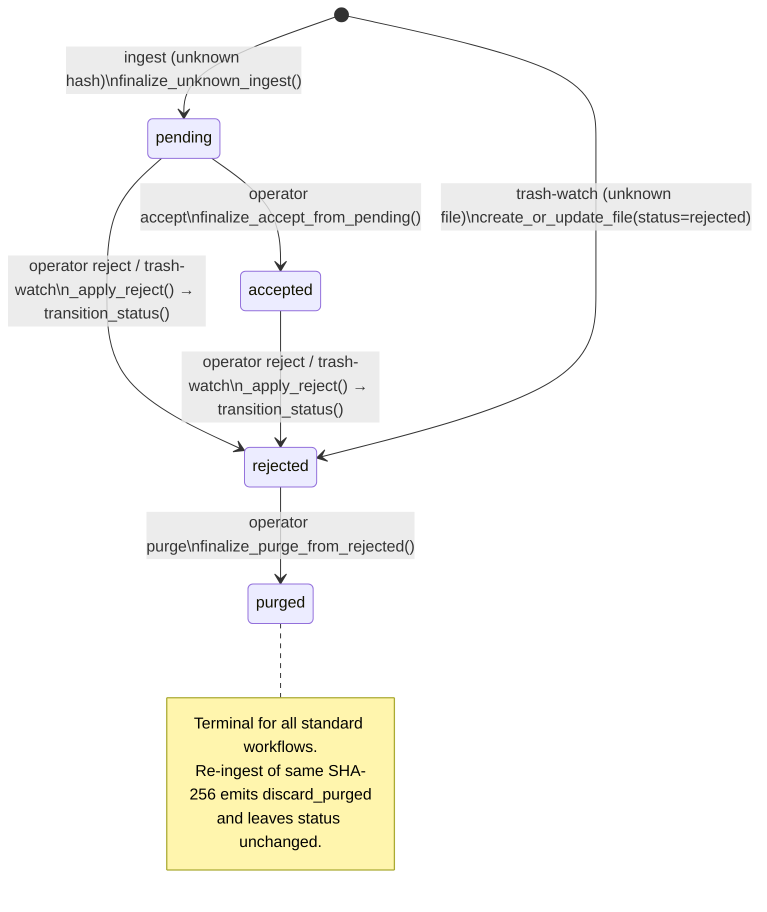

# File Status State Machine

**Scope:** `files.status` field in the SQLite registry  
**Source authority:** `src/nightfall_photo_ingress/domain/registry.py`, `src/nightfall_photo_ingress/reject.py`, `src/nightfall_photo_ingress/domain/ingest.py`  
**Status:** Authoritative  
**Created:** 2026-04-03  

---

## 1. Overview

Every file tracked by photo-ingress has a `status` field in the `files` table. This field is
the single canonical authority on where a file sits in the operator review lifecycle. All
operator actions (accept, reject, purge) and all pipeline actions (ingest, discard) are
expressed as transitions of this field with accompanying audit log entries.

This document defines all valid status values, all valid and invalid transitions, the code
path that triggers each transition, the guard conditions that must hold, the side effects
produced (registry writes and physical file moves), and the error raised when a guard fails.

The `live_photo_pairs.status` field is a parallel but distinct state machine with five
values instead of four. It is documented in
[`design/architecture/live-photo-pair-lifecycle.md`](live-photo-pair-lifecycle.md).

---

## 2. Valid Status Values

| Value | Meaning | `current_path` state |
|-------|---------|----------------------|
| `pending` | File is staged in the pending queue awaiting operator review | Set — points to a file under `pending_path` |
| `accepted` | Operator has accepted the file; it is stored in the permanent accepted library | Set — points to a file under `accepted_path` |
| `rejected` | Operator has rejected the file; it is retained in the rejected store for audit purposes | Set — points to a file under `rejected_path`; may be NULL if file was unknown at rejection time |
| `purged` | Operator has permanently deleted the file; record is retained as a tombstone | Always NULL (cleared at transition time) |

These four values are the complete set. They are declared as:
```python
ALLOWED_FILE_STATUSES = {"pending", "accepted", "rejected", "purged"}
```
and enforced at both the Python layer (`_validate_status()`) and the SQLite layer:
```sql
status TEXT NOT NULL CHECK (status IN ('pending', 'accepted', 'rejected', 'purged'))
```

---

## 3. State Diagram



---

## 4. Transition Table

Each row describes one transition. Columns:
- **From / To**: status values before and after the transition.
- **Trigger / Code Path**: the public API function and the registry method it ultimately calls.
- **Guard Condition**: the pre-condition checked before the transition is applied. If the guard fails the transition is aborted and an error is raised.
- **Side Effects**: all writes and physical file operations that occur atomically with the status change.
- **Error if Guard Fails**: the exception type and message pattern raised on violation.

---

### T-1 — (new) → `pending`

**Description:** A file with an unknown SHA-256 is ingested for the first time from a
OneDrive staging area.

| Column | Detail |
|--------|--------|
| **From** | *(record does not exist)* |
| **To** | `pending` |
| **Trigger** | `IngestDecisionEngine._process_one()` (ingest pipeline) |
| **Registry method** | `Registry.finalize_unknown_ingest()` |
| **Guard** | SHA-256 is not present in the `files` table (i.e. `get_file()` returns `None`). If already present, T-5 (discard) applies instead. |
| **Side effects (one atomic transaction)** | 1. `files` row created: `status='pending'`, `current_path=<pending_root/relative>`. 2. `metadata_index` row upserted. 3. `file_origins` row upserted. 4. `audit_log` row: `action='pending'`, `reason='unknown_hash'`, `actor='ingest_pipeline'`. |
| **Physical** | Staging file committed into `pending_path` (via `commit_staging_to_accepted()`). |
| **Error if guard fails** | Guard is a code-path branch, not an exception — if SHA-256 is known, the call is routed to `finalize_known_ingest()` (T-5) instead. |

**Important upsert note:** `finalize_unknown_ingest()` uses `ON CONFLICT(sha256) DO UPDATE
SET status = 'pending'`. In normal operation this path is reached only when no record
exists. If a race or bug causes it to run against an existing record, the status would be
forcibly reset to `pending`. This is a defensive upsert artefact, not a documented
transition.

---

### T-2 — `pending` → `accepted`

**Description:** An operator explicitly accepts a pending file, moving it to the
permanent accepted library.

| Column | Detail |
|--------|--------|
| **From** | `pending` |
| **To** | `accepted` |
| **Trigger** | `reject.accept_sha256()` (CLI `accept` command) |
| **Registry method** | `Registry.finalize_accept_from_pending()` |
| **Guard** | `record.status == 'pending'`. Checked twice: first in `accept_sha256()` (raises `RejectFlowError`) and again inside `finalize_accept_from_pending()` under `BEGIN IMMEDIATE` (raises `RegistryError`). |
| **Side effects (one atomic transaction)** | 1. `files.status` → `'accepted'`. 2. `files.current_path` → accepted destination path. 3. `files.updated_at` → now. 4. `accepted_records` row inserted. 5. `audit_log` row: `action='accepted'`, `reason=<operator reason>`, `actor=<operator>`. |
| **Physical** | File moved from `pending_path` to `accepted_path` via `commit_pending_to_accepted()`, which may use a rename (same pool) or copy+delete (cross-pool). Move completes before the registry transaction. |
| **Error if guard fails** | `RejectFlowError("Cannot accept sha256 with status '<status>': expected 'pending'")`. If the SHA-256 does not exist at all: `RejectFlowError("Unknown SHA-256: <sha256>")`. |

---

### T-3 — `pending` → `rejected`

**Description:** An operator rejects a pending file via CLI or by moving it to the trash
directory.

| Column | Detail |
|--------|--------|
| **From** | `pending` |
| **To** | `rejected` |
| **Trigger** | `reject.reject_sha256()` (CLI `reject`) or `reject.process_trash()` (trash-watch) |
| **Registry method** | `Registry.transition_status(sha256, 'rejected', ...)` via `_apply_reject()` |
| **Guard** | Record must exist. `record.status` must not already be `'rejected'` (idempotent noop if already rejected). File must be within `pending_path` or `accepted_path` (safety guard on the physical move). |
| **Side effects** | 1. `files.status` → `'rejected'`. 2. `files.current_path` → rejected destination path (updated via `update_current_path()`). 3. `files.updated_at` → now. 4. `audit_log` row: `action='rejected'`, `reason=<reason>`, `actor=<actor>`. |
| **Physical** | File moved from `pending_path` to `rejected_path` via `_move_physical_to_rejected()`. |
| **Error if guard fails** | If the file's current path is outside both `pending_path` and `accepted_path`: `RejectFlowError("Unsafe reject source outside managed queue roots: ...")`. |

---

### T-4 — `accepted` → `rejected`

**Description:** An operator rejects a previously accepted file (re-rejection). This is a
valid operator workflow: a file that was accepted can be subsequently rejected by the
operator returning it to a reject-eligible state.

| Column | Detail |
|--------|--------|
| **From** | `accepted` |
| **To** | `rejected` |
| **Trigger** | `reject.reject_sha256()` (CLI) or `reject.process_trash()` (trash-watch, if the accepted file is moved to trash) |
| **Registry method** | `Registry.transition_status(sha256, 'rejected', ...)` via `_apply_reject()` |
| **Guard** | Same as T-3. `record.status` must not already be `'rejected'`. File must be within `pending_path` or `accepted_path`. |
| **Side effects** | Same as T-3. `files.status` → `'rejected'`, `current_path` updated, `audit_log` row. |
| **Physical** | File moved from `accepted_path` to `rejected_path`. |
| **Error if guard fails** | Same as T-3. |

**Design note:** `accepted → rejected` is an intentional operator workflow (not an
implementation artefact). The `_apply_reject()` function handles files in `accepted_path`
as well as `pending_path`. Once rejected, the file is purge-eligible via T-6.

---

### T-5 — (any existing status) — discard, no transition

**Description:** A file whose SHA-256 already exists in the registry is ingested again
(same content seen in OneDrive a second time). The staged copy is deleted; no status
transition occurs. This is NOT a state machine transition but is documented here to
clarify why re-ingesting a `purged` file does not reset it to `pending`.

| Column | Detail |
|--------|--------|
| **From / To** | Status unchanged (any value) |
| **Trigger** | `IngestDecisionEngine._process_one()` — known-hash branch |
| **Registry method** | `Registry.finalize_known_ingest()` |
| **Guard** | `get_file(sha256)` returns a non-None record. |
| **Side effects** | 1. `metadata_index` row upserted (ownership record updated). 2. `file_origins` row upserted. 3. `audit_log` row: `action='discard_<current_status>'`, `reason='known_hash'`, `actor='ingest_pipeline'`. |
| **Physical** | Staging file deleted (`path.unlink()`). |
| **Outcome action string** | `discard_pending` / `discard_accepted` / `discard_rejected` / `discard_purged` |

**Metadata prefilter variant:** When the metadata index matches before hashing, the
action is the same (`discard_<status>`), but the audit_log action is `prefilter_<status>`
and the `IngestOutcome.prefilter_hit` flag is set. The status is still unchanged.

---

### T-6 — `rejected` → `purged`

**Description:** An operator permanently deletes a rejected file. The file is removed
from disk and the registry record is tombstoned.

| Column | Detail |
|--------|--------|
| **From** | `rejected` |
| **To** | `purged` |
| **Trigger** | `reject.purge_sha256()` (CLI `purge` command) |
| **Registry method** | `Registry.finalize_purge_from_rejected()` |
| **Guard** | `record.status == 'rejected'`. Checked twice: first in `purge_sha256()` (raises `RejectFlowError`), again inside `finalize_purge_from_rejected()` under `BEGIN IMMEDIATE` (raises `RegistryError`). |
| **Side effects (one atomic transaction)** | 1. `files.status` → `'purged'`. 2. `files.current_path` → `NULL`. 3. `files.updated_at` → now. 4. `audit_log` row: `action='purged'`, `reason=<reason>`, `actor=<actor>`. |
| **Physical** | File deleted via `current.unlink(missing_ok=True)` **before** the registry transaction. If the file is missing from disk, the deletion is silently skipped; the registry transition still proceeds. |
| **Error if guard fails** | `RejectFlowError("Cannot purge sha256 with status '<status>': expected 'rejected'")`, wrapping `RegistryError` from the registry layer. |

---

### T-7 — (new) → `rejected` (unknown file in trash)

**Description:** A file appears in the trash directory that has no corresponding registry
record. The trash-watch processor creates a new `rejected` record directly, without
passing through `pending`.

| Column | Detail |
|--------|--------|
| **From** | *(record does not exist)* |
| **To** | `rejected` |
| **Trigger** | `reject.process_trash()` (trash-watch), SHA-256 not in registry |
| **Registry method** | `Registry.create_or_update_file(status='rejected')` then `Registry.append_audit_event(action='rejected')` |
| **Guard** | `get_file(sha256) is None` — record must not exist. |
| **Side effects** | 1. `files` row created: `status='rejected'`, `current_path=<rejected_path>` (if file was physically moved). 2. `audit_log` row: `action='rejected'`, `reason='trash_reject'`, `actor='trash_watch'`. |
| **Physical** | Source file in trash moved to `rejected_path` (via `_move_physical_to_rejected()`), then original trash file deleted. |
| **Outcome action string** | `rejected_unknown` |

---

## 5. Prohibited Transitions

The following transitions are blocked by explicit guards and will raise an exception:

| Attempted transition | Guard that blocks it | Error raised |
|----------------------|---------------------|--------------|
| `accepted → accepted` (re-accept) | `record.status != 'pending'` in `finalize_accept_from_pending()` | `RegistryError` / `RejectFlowError` |
| `rejected → accepted` | Same guard — only `pending` is accepted | `RejectFlowError` |
| `purged → accepted` | Same guard | `RejectFlowError` |
| `pending → purged` (skip rejected) | `record.status != 'rejected'` in `finalize_purge_from_rejected()` | `RejectFlowError` |
| `accepted → purged` | Same guard | `RejectFlowError` |
| `any → purged` via purge, unless from `rejected` | Same guard | `RejectFlowError` |

---

## 6. Terminal State

**`purged` is the terminal state for all standard operator workflows.**

- `accept_sha256()` — blocked by guard (T-2 requires `pending`).
- `reject_sha256()` / `process_trash()` — technically reachable from `purged` via
  `_apply_reject()` because `transition_status()` does not guard against the source
  status; however, since `purged` records have `current_path = NULL`, no physical file
  move occurs. This transition path exists in the implementation but is not a documented
  operator workflow.
- `purge_sha256()` — blocked by guard (T-6 requires `rejected`).

**Re-ingest of a `purged` hash:** If a file with a `purged` SHA-256 reappears in a
OneDrive ingest batch, the ingest pipeline routes it to T-5 (discard). The staging file
is deleted and an `audit_log` entry `discard_purged` is emitted. The `files.status`
remains `purged`. `purged` is therefore a permanent tombstone — it cannot be reset to
`pending` through any standard workflow.

---

## 7. The `transition_status()` Escape Hatch

`Registry.transition_status()` is a freeform status setter. It validates that
`new_status` is in `ALLOWED_FILE_STATUSES` but does **not** check the current status of
the record. It is used by:

| Caller | When | New status set to |
|--------|------|-------------------|
| `_apply_reject()` in `reject.py` | Any reject action on a known file not in a live photo pair | `'rejected'` |
| `Registry.apply_live_photo_pair_status()` | Propagating pair-level status to both member records | Any value in `{"pending", "accepted", "rejected", "purged"}` |

The `apply_live_photo_pair_status()` method uses `transition_status()` to synchronise
pair member `files.status` values with the pair's composite lifecycle status. This is the
only code path that can drive a `files.status` to `'purged'` without using
`finalize_purge_from_rejected()`. The pair lifecycle is documented in
[`design/architecture/live-photo-pair-lifecycle.md`](live-photo-pair-lifecycle.md).

---

## 8. Audit Log Actions Reference

The following `audit_log.action` values are produced by transitions or adjacent events.

| Action | Produced by | Meaning |
|--------|-------------|---------|
| `pending` | T-1 (`finalize_unknown_ingest`) | File entered pending queue |
| `accepted` | T-2 (`finalize_accept_from_pending`) | File accepted by operator |
| `rejected` | T-3, T-4, T-7 (`transition_status` or `append_audit_event`) | File rejected by operator or trash-watch |
| `purged` | T-6 (`finalize_purge_from_rejected`) | File permanently deleted by operator |
| `discard_pending` | T-5 (`finalize_known_ingest`) | Staged copy discarded; file already `pending` |
| `discard_accepted` | T-5 (`finalize_known_ingest`) | Staged copy discarded; file already `accepted` |
| `discard_rejected` | T-5 (`finalize_known_ingest`) | Staged copy discarded; file already `rejected` |
| `discard_purged` | T-5 (`finalize_known_ingest`) | Staged copy discarded; file already `purged` (tombstone) |
| `prefilter_pending` | Metadata prefilter (no hash needed) | As `discard_pending` but detected without full hash |
| `prefilter_accepted` | Metadata prefilter | As `discard_accepted` |
| `prefilter_rejected` | Metadata prefilter | As `discard_rejected` |
| `prefilter_purged` | Metadata prefilter | As `discard_purged` |
| `reject_noop_already_rejected` | `_apply_reject()` | Reject attempted on already-rejected file; no transition |

**Key invariant:** `discard_*` and `prefilter_*` audit actions **never produce a status
transition**. They are read-only observations written to the audit log. The `files.status`
is unchanged after any `discard_*` or `prefilter_*` event.

---

## 9. Physical File Location by Status

| Status | Expected physical location |
|--------|---------------------------|
| `pending` | `<pending_path>/<rendered_storage_template>` |
| `accepted` | `<accepted_path>/<rendered_accepted_storage_template>` |
| `rejected` | `<rejected_path>/<rendered_storage_template>` |
| `purged` | *(deleted — no file exists)* |

`current_path` in the `files` table tracks the exact path. It is updated at each
transition that moves the file. It is set to `NULL` only at `rejected → purged`. A NULL
`current_path` on a `pending`, `accepted`, or `rejected` record indicates an inconsistency
(file missing from disk) that the staging reconciliation process handles.

---

## 10. Cross-References

- **Live Photo pair state machine:** [`design/architecture/live-photo-pair-lifecycle.md`](live-photo-pair-lifecycle.md) — the `live_photo_pairs.status` field has its own 5-value state machine; pair status transitions drive member `files.status` transitions via `apply_live_photo_pair_status()`.
- **Operator workflows:** [`docs/operations-runbook.md`](../../docs/operations-runbook.md) — CLI invocations for accept, reject, purge, and trash-watch setup.
- **Schema definition:** [`design/architecture/schema-and-migrations.md`](schema-and-migrations.md) — full DDL for the `files` table including the `CHECK` constraint.
- **Domain overview:** [`design/domain-architecture-overview.md`](../domain-architecture-overview.md) — §6 Pipeline Behaviour describes the accept/reject/purge flows in narrative form.

---

## 11. Chunk 4 Web Triage Mutation Path

Chunk 4 introduced API triage write endpoints in `api/routers/triage.py` and
`api/services/triage_service.py`.

Implemented action mapping:

- `accept` -> `files.status = 'accepted'`
- `reject` -> `files.status = 'rejected'`
- `defer` -> `files.status = 'pending'`

Implementation note:

- This path currently updates `files.status` directly in SQL and appends triage audit
  events (`triage_<action>_requested`, `triage_<action>_applied`, optional
  `triage_<action>_compensating`) via `api/audit_hook.py`.
- The triage API path is registry-only in Chunk 4; it does not perform file-system
  move operations.

Design drift recorded:

- Unlike CLI accept/reject/purge flows, Chunk 4 triage does not yet enforce detailed
  source-status guards before transition. Hardening this parity is deferred and should
  be addressed in a future refinement chunk.

## 12. Chunk 5 Blocklist Ingest Enforcement

Chunk 5 adds an ingest-time transition path for blocklist matches:

- Evaluation point: after SHA-256 computation, before unknown-file `pending` persistence.
- Rule source: enabled `blocked_rules` entries (`filename` glob and `regex`).
- On match:
  - staged file is removed,
  - `files` row is created/updated with `status = 'rejected'`,
  - audit event `action='rejected'` is appended with reason `block_rule:<rule_type>:<pattern>`,
  - ingest outcome is `discard_rejected`.

Behavioral result:

- Blocked files are persisted as rejected tombstones and therefore skip pending review.
- Subsequent replays of the same hash continue through known-hash discard semantics and
  do not re-enter pending.
