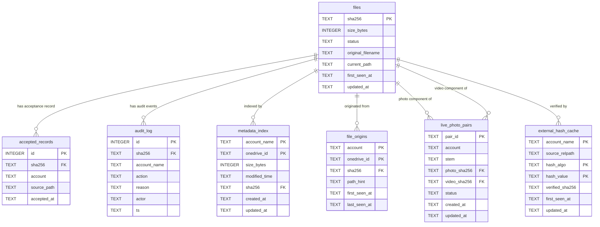

# Domain Model

**Status:** active  
**Sources:** `ARCHITECTURE.md`, `design/domain-architecture-overview.md` §5 and §9, `design/specs/registry.md`  
**See also:** [glossary.md](glossary.md), [specs/registry.md](../specs/registry.md), [architecture/data-flow.md](../architecture/data-flow.md)

---

## Bounded Context

photo-ingress is a single bounded context: a **media ingest pipeline** that accepts
files from pluggable external provider adapters (currently OneDrive), manages their
lifecycle under explicit operator control, and delivers accepted content to the boundary
of a permanent media library.

The context boundary is defined by:

- **Inbound boundary:** provider adapter delta streams (currently OneDrive Graph API
  delta pagination). The adapter layer is isolated; all communication with external
  systems lives in `adapters/`.
- **Outbound boundary:** `accepted_path` queue directory. Operators transfer files from
  `accepted_path` to the permanent library (`/nightfall/media/pictures`) manually. No
  write path from this context crosses into the permanent library.
- **Registry as system of record:** the SQLite `registry.db` on SSD is the only durable
  state within this context. All operator and pipeline decisions derive from registry
  state.

Immich is outside this context. It indexes the permanent library as a read-only external
library and has no API or event relationship to the ingest pipeline.

---

## Primary Domain Entities

| Entity | Table / Structure | Module ownership | Lifecycle |
|---|---|---|---|
| **File identity** | `files` | `domain/registry.py` | Created on first download with `status = 'pending'`. Transitions: `pending → accepted`, `pending → rejected`, `rejected → purged`. SHA-256 (`sha256 TEXT PRIMARY KEY`) is the canonical, immutable identity key. |
| **Acceptance record** | `accepted_records` | `domain/registry.py` | Written once per explicit `accept` invocation. Never modified or deleted. Preserves acceptance history even after the operator relocates the file away from `accepted_path`. |
| **Metadata pre-filter entry** | `metadata_index` | `domain/registry.py` | Written on first successful download. Key: `(account_name, onedrive_id)`. Used on subsequent polls to skip re-downloading an OneDrive item whose `size_bytes` and `modified_time` are unchanged. |
| **File provenance** | `file_origins` | `domain/registry.py` | Records `(account, onedrive_id) → sha256` for every item ever encountered. Appended on first encounter; never deleted. Key: `(account, onedrive_id)`. |
| **Hash import cache** | `external_hash_cache` | `domain/registry.py` | Stores hashes imported from the permanent library. The `hash-import` CLI command (Issue #65) imports authoritative SHA-256 hashes from `.hashes.v2` files with `imported = true` and `source = "hash_import"`. `source_relpath` is `NULL` for hash-import entries and never implies origin paths. Legacy `sync-import` imported advisory SHA-1 from `.hashes.sha1` files (deprecated). Imported entries are used for dedupe index lookups during ingest pre-download filtering only; they do not create `files` rows, audit events, or lifecycle state. See [architecture/invariants.md](../architecture/invariants.md) §Hash Import Invariants. |
| **Audit event** | `audit_log` | `domain/registry.py` | Append-only; one row per state transition or pipeline event. Protected by SQL triggers against update and delete. Never cleared. |
| **Live Photo pair** | `live_photo_pairs` | `domain/registry.py` | Links photo component (`photo_sha256`) and video component (`video_sha256`) of an Apple Live Photo by shared filename stem and capture-time heuristic. Status mirrors the component files. |
| **Ingest terminal event** | `ingest_terminal_audit` | `domain/registry.py` | Optional batch-run audit table; one row per ingest decision keyed by `batch_run_id`. Produced when configured. |
| **UI idempotency replay** | `ui_action_idempotency` | `api/services/triage_service.py`, `api/services/blocklist_service.py` + `domain/registry.py` table bootstrap | Stores triage and blocklist mutation replay responses keyed by `X-Idempotency-Key`; prevents duplicate state changes for retried requests and enforces conflict on mismatched key reuse. |
| **Lifecycle journal record** | JSONL file on SSD | `domain/journal.py` | Append-only per-operation crash-boundary record (`ingest_started`, `hash_completed`, `registry_persisted`). Ephemeral; cleared after successful startup replay. Not a permanent store. |
| **Downloaded handoff** | `DownloadedHandoffCandidate` (dataclass) | `adapters/onedrive/client.py` | Ephemeral M3 → M4 boundary contract: produced by the adapter for each downloaded file; consumed immediately by `IngestDecisionEngine`. Carries staging path, metadata, and account context. Never persisted. |
| **Ingest decision** | `IngestOutcome` (dataclass) | `domain/ingest.py` | Returned from `IngestDecisionEngine.process()`. Carries action, sha256, destination path, and audit reason. Never persisted. |
| **Status snapshot** | JSON file at `/run/nightfall-status.d/photo-ingress.json` | `status.py` | Written atomically after each CLI command that modifies system state. Read by nightfall-mcp for operator health visibility. Not a registry entity. |

---

## Module-Layer Map

The codebase is structured into three layers. The domain layer has no dependency on any
adapter; adapters do not depend on each other. CLI modules are thin orchestrators.

```
┌─────────────────────────────────────────────────────────────────┐
│  cli.py · reject.py · hash_import.py · sync_import.py (deprecated) · status.py               │
│  ─────────────────────────────────────────────────────────────  │
│  Thin orchestrators only — no business logic                    │
└───────────────────────┬─────────────────────────────────────────┘
                        │ calls
         ┌──────────────┴────────────────┐
         ▼                               ▼
┌──────────────────────┐    ┌─────────────────────────────────────┐
│  adapters/onedrive/  │    │  domain/                            │
│                      │    │                                     │
│  auth.py         ────┼───▶│  registry.py   (SQLite CRUD, audit) │
│  client.py       ────┼───▶│  ingest.py     (policy decisions)   │
│  retry.py            │    │  storage.py    (path render, moves) │
│  cache_lock.py       │    │  journal.py    (crash-recovery log) │
│  errors.py           │    │  migrations/   (schema bootstrap)   │
│  safe_logging.py     │    └─────────────────────────────────────┘
└──────────────────────┘
┌──────────────────────┐
│  runtime/            │
│  process_lock.py     │  ← global fcntl advisory lock (poll serialisation)
└──────────────────────┘
```

**Layer rule:** `domain/` ← `adapters/` ← `cli` (uni-directional dependency only).
The domain layer must never import from `adapters/`. This is enforced by convention and
verified by running domain unit tests in isolation.

For the full file-system layout and adapter extensibility patterns, see
[`ARCHITECTURE.md`](../../ARCHITECTURE.md). This document supersedes `ARCHITECTURE.md`
for domain entity descriptions.

---

## Entity Relationship Diagram



---

## Notes

- The `files` table is the root anchor for all entity relationships. Every foreign key
  in the registry points to `files.sha256`.
- `metadata_index` and `file_origins` both key on `(account_name, onedrive_id)` — they
  represent different views of the same external identifier. `metadata_index` is a
  download-skip optimisation; `file_origins` is a permanent provenance record.
- `external_hash_cache.verified_sha256` is `NULL` until one server-side SHA-256
  verification is performed (legacy `sync-import` model); for `hash-import` entries,
  the SHA-256 is authoritative at import time and `verified_sha256` is not required.
- The `hash-import` command (Issue #65) writes to `external_hash_cache` only and does
  not create `files` rows. Imported entries have no `files.status`, no lifecycle, and
  are not visible in audit or UI surfaces.
- The `live_photo_pairs.status` field mirrors the component file status but is not
  authoritative. Component `files` rows are always the status source of truth.

---

*For the full schema DDL, see [specs/registry.md](../specs/registry.md).*  
*For the state machine governing `files.status`, see [architecture/state-machine.md](state-machine.md).*  
*For the ingest pipeline data flow, see [architecture/data-flow.md](data-flow.md).*  
*For the domain term definitions, see [domain/glossary.md](glossary.md).*
