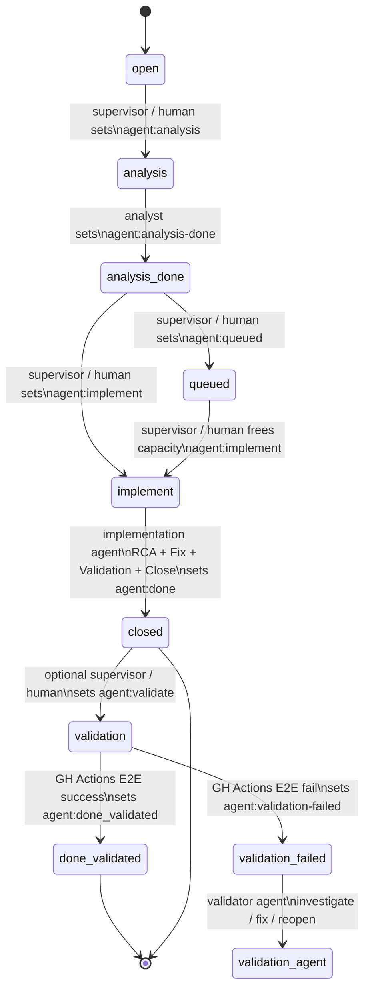

# mAOF – modular Multi Agent Orchestration Framework

The modular Agent Orchestration Framework (mAOF) defines a deterministic,
auditable, label‑driven workflow for multi‑agent collaboration inside GitHub.
It provides a clear state machine, strict role separation, and optional
automation layers for supervision and validation.

mAOF is designed for repositories that use MCP, govctl JSON mode, and
containerized development environments. It supports both human‑in‑the‑loop
operation and full automation.

---

## 1. Goals

- Deterministic, reproducible agent workflows  
- Explicit state transitions via GitHub labels  
- Clear separation of responsibilities (Analyst → Implementer → Validator)  
- Zero‑drift, zero‑overreach execution  
- Human supervision possible at every stage  
- Optional second validation ring via GitHub Actions  
- Full compatibility with MCP task surfaces (govctl run … --json)  

---

## 2. mAOF State Machine

The mAOF state machine defines the lifecycle of an issue as it moves through
analysis, implementation, and optional validation.



---

## 3. State Labels

Each state corresponds to exactly one active mAOF label:

| State               | Label                     |
|---------------------|----------------------------|
| analysis            | agent:analysis            |
| analysis-done       | agent:analysis-done       |
| implement           | agent:implement           |
| queued              | agent:queued              |
| closed (impl done)  | agent:done                |
| validation          | agent:validate            |
| validation failed   | agent:validation-failed   |
| validated           | agent:done_validated      |

Invariant:  
An issue must never have more than one active mAOF state label.

---

## 4. Agent Roles

### 4.1 Analyst Agent

Responsible for preparing the issue for implementation.

Tasks:
- Reproduce the problem  
- Produce structured RCA (hypothesis level)  
- Define minimal fix scope  
- Propose fix strategies  
- Document findings  
- Set agent:analysis-done  

Prompt file:
```text
.github/prompts/issue-analyst-agent.txt
```

---

### 4.2 Implementation Agent

Responsible for resolving the issue end‑to‑end.

Tasks:
- Perform final RCA  
- Implement minimal fix  
- Validate locally  
- Document results  
- Commit and push  
- Close the issue  
- Set agent:done  

Prompt file:
```text  
.github/prompts/issue-implementation-agent.txt
```

---

### 4.3 Validator Agent (optional)

Responsible for post‑closure validation.

Tasks:
- Reproduce original defect  
- Validate fix correctness  
- Run regression checks  
- Validate UI/UX fidelity (if applicable)  
- Validate architectural invariants  
- Set agent:done_validated or agent:validation-failed  

Prompt file:
```text  
.github/prompts/issue-validator-agent.txt`
```

---

### 4.4 Supervisor (human or automated)

Responsible for state transitions and governance.

Tasks:
- Apply labels  
- Manage queueing (agent:queued)  
- Detect deadlocks  
- Correct inconsistent states  
- Trigger optional validation  

Prompt file (for automated mode):
```text  
.github/prompts/issue-supervisor-agent.txt
```

---

## 5. Automation Layers

mAOF supports two automation layers:

### 5.1 Supervisor‑Light

- Triggered on every issue event  
- No LLM usage  
- Manages queueing and trivial state corrections  
- Ensures capacity limits for agent:implement  

Workflow file:  
```text
.github/workflows/supervisor-light.yml
```

---

### 5.2 Supervisor‑Smart

- Triggered periodically or manually  
- Uses Copilot Supervisor Agent  
- Detects deadlocks and complex inconsistencies  
- Performs corrective actions  

Workflow file:
```text  
.github/workflows/supervisor-smart.yml
```

---

## 6. Validation Pipeline

mAOF supports an optional second validation ring executed via GitHub Actions.

### 6.1 Trigger

Validation is triggered when the Supervisor (human or automated) sets:

agent:validate

### 6.2 Execution

The validation workflow runs:

```bash
./dev/bin/govctl run staging.e2e.module1 --json
```

This target is defined in dev/govctl-targets.yaml and executes the canonical
E2E test suite against the staging container.

### 6.3 Result Mapping

| Result       | Label                   | Meaning                                      |
|--------------|-------------------------|----------------------------------------------|
| Exit code 0  | agent:done_validated    | Fix validated successfully                   |
| Exit code ≠ 0| agent:validation-failed | Fix failed validation; Validator Agent takes over |

Workflow file:
```text  
.github/workflows/issue-validation.yml
```

---

## 7. Human‑in‑the‑Loop Mode

During early development, the human operator acts as Supervisor:

- Manually sets agent:analysis, agent:implement, agent:queued, agent:validate  
- Reviews agent output  
- Oversees transitions  
- Ensures correctness before automation is enabled  

This mode is recommended until Supervisor‑Light and Supervisor‑Smart are fully tuned.

---

## 8. Integration with MCP and govctl

mAOF is designed to work with the repository’s MCP server and the canonical
execution surface:

```bash
govctl run <target> --json
```

Agents must not call devctl, stagingctl, or raw Python entry points directly.
All execution must go through mapped MCP tasks or govctl targets.

---

## 9. File Locations

| Component                | Path                                             |
|--------------------------|--------------------------------------------------|
| Analyst Prompt           | .github/prompts/issue-analyst-agent.txt         |
| Implementation Prompt    | .github/prompts/issue-implementation-agent.txt  |
| Validator Prompt         | .github/prompts/issue-validator-agent.txt       |
| Supervisor Prompt        | .github/prompts/issue-supervisor-agent.txt      |
| Supervisor-Light Workflow| .github/workflows/supervisor-light.yml          |
| Supervisor-Smart Workflow| .github/workflows/supervisor-smart.yml          |
| Validation Workflow      | .github/workflows/issue-validation.yml          |

---

## 10. Future Extensions

- Automated Supervisor‑Smart heuristics  
- Multi‑module validation gates  
- Architecture‑level invariant checks  
- Automatic reopening of failed issues  
- Integration with metrics pipelines  

---

## 11. Summary

mAOF provides a deterministic, auditable, and extensible framework for
multi‑agent collaboration in GitHub. It integrates seamlessly with MCP,
govctl, containerized development, and staged E2E validation. The framework
supports both human‑supervised and fully automated operation and is designed
to scale with increasing agent complexity.
